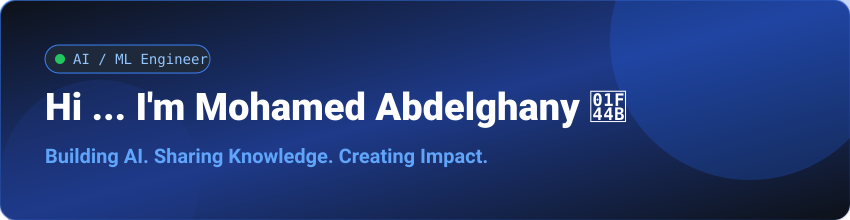

<!--horizontal Color-->

<!-- It's me 😄-->

  

 

  <a href="https://github.com/Mo7amed3bdelghany">
	  
    <!--  -->
  </a>

 

    
<!-- About Me -->
##  About Me:

#### AI Engineer specializing in Machine Learning, Deep Learning, Computer Vision, and Generative AI. Experienced in designing and developing end-to-end AI solutions powered by LLMs, RAG pipelines, AI Agents, and intelligent automation. Passionate about transforming complex AI technologies into scalable, real-world applications while continuously exploring the latest advancements in artificial intelligence.

 

<!--  -->

- 🤖 Building AI Agents and LLM-powered applications.
- 🚀 Turning AI ideas into real-world solutions.
- 🌱 Continuously exploring the latest advancements in AI.
- 🎥 Sharing AI knowledge through YouTube.
- ❤️ Contributing to open-source projects.
- 🤝 Open to collaboration on impactful AI projects.
    

<!-- ================= TECH STACK ================= -->
##  Tech Stack:

###  Programming Languages

  &emsp;
  &emsp;
  &emsp;
  &emsp;

### 🤖 Machine Learning & Deep Learning

  &emsp;
  &emsp;
  &emsp;
  &emsp;
  

### 🧬 Generative AI, NLP & LLMs

  &emsp;
  &emsp;
  &emsp;
  &emsp;
  &emsp;
  &emsp;
  &emsp;

### 🤖 AI Agents & Automation

 
	&emsp; 
	&emsp; 
	&emsp; 
	&emsp; 

###  RAG & Vector Databases

 
	&emsp; 
	&emsp; 
	&emsp; 
	&emsp; 

### 📊 Data Science & Analysis 

 
	&emsp; 
	&emsp; 
	&emsp; 
	&emsp; 
	 

### 🚀 MLOps & Deployment

 
	&emsp; 
	&emsp; 
	&emsp; 
	&emsp; 
	&emsp; 
	&emsp; 
	 

### 🗄️ Databases

 
	&emsp; 
	&emsp; 
	&emsp; 

### ☁️ Cloud Platforms 

 
	&emsp; 
	&emsp; 
	

 ###  Developer Tools & AI Coding

  &emsp;
  &emsp;
  &emsp;
  &emsp;
  &emsp;
  &emsp;
  &emsp;
  &emsp;
  &emsp;
  

###   Operating Systems

  &emsp;
  &emsp;
  

 

<!--
<!-- ================= CERTIFICATIONS ================= --

## 📜 Certifications & Achievements

   &emsp;&emsp;

  

  <a href="https://coursera.org/share/0d95ac2658cb012eb8a47d5c0c09c004">
    🏆 <b>Supervised Machine Learning with Andrew NG</b>
  </a>

  &emsp;&emsp;

  <a href="https://www.udemy.com/certificate/UC-feebaa83-9f9e-4f73-bf74-2293dd8b80b4/">
    🏆 <b>Deep Learning for NLP</b>
  </a>
  &emsp;&emsp;

-->
---

 

<!-- ================= YOUTUBE ================= -->

##  Learn AI With Me

🎥 I share practical content about
<b>Artificial Intelligence, Machine Learning, Data Science, and Generative AI.</b>

 

 
<a href="https://www.youtube.com/@Mo7amed3bdelghany">
  🔴 <b>Subscribe and Join the Learning Journey!</b>
</a>

---

<!-- 
---       

## 📈 GitHub Stats

	&emsp;
    
	&emsp;
    

## 🏆 GitHub Trophies

 

	&emsp;
    

 

## 📊 Activity Graph

 

	&emsp;
    

 

   -->

## 🐍  A Snake Eating My Contributions Graph!

   
<!-- Connect Us -->
<h3 align="center" >  Connect With Me 🤝 </h3>

<!-- MY_Links -->
  

	
	
	
    
	

<!--horizontal Color-->

<!-- ❤️🔥-->
<h5> Made With ❤️ by <a href="https://www.linkedin.com/in/mo7amed-3bdelghany"> Mo7amed_3bdelghany </a> </h5>
Last Edited on: 30/8/2026

<!--  -->

  

